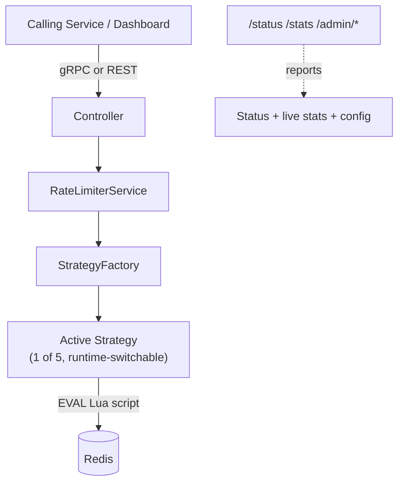

# ⚡ Rate Limiter as a Service

A production-shaped, config-switchable rate limiting microservice — built as standalone infrastructure other services call, not middleware bolted onto one app.

Implements **all 5 major rate limiting algorithms** behind one interface (Strategy Pattern), each backed by an **atomic Redis Lua script**, exposed over both **gRPC** (real inter-service contract) and **REST** (for hosting-compatible, browser-friendly access).

🔗 **Live API:** https://rate-limiter-x.onrender.com
📘 **API docs (Swagger):** https://rate-limiter-x.onrender.com/docs
🖥️ **Live dashboard:** https://rate-limiter-dashboard-rouge.vercel.app
📦 **Dashboard repo:** [rate-limiter-dashboard](../rate-limiter-dashboard)

> Hosted on Render's free tier — if idle for a while, the first request after a gap may take 10–30s to wake up.

---

## Why this exists

Most rate limiting is middleware inside a single app. This treats it as **shared infrastructure**: one endpoint — `CheckLimit(key) → allowed/denied` — that any number of services call in milliseconds.

Covers atomic concurrency control, the Strategy Pattern, dual-protocol service design, and graceful degradation with real observability.

---

## Architecture



The algorithm and its parameters are **runtime-mutable** via `/admin/*` endpoints (not just `.env`-locked at boot) — this powers the live dashboard's algorithm switcher and parameter tuning without redeploys.

---

## The 5 algorithms

| Algorithm | Redis structure | Trade-off |
|---|---|---|
| **Token Bucket** | Hash | Smooth continuous refill, allows controlled bursts. Industry default. |
| **Fixed Window** | Counter | Cheapest, but boundary-burst exploit (2× traffic at window edges) |
| **Sliding Window Log** | Sorted Set | Most precise, no boundary exploit — but memory scales with volume |
| **Sliding Window Counter** | 2 weighted counters | Production-realistic middle ground: near-Log accuracy, near-Fixed-Window cost |
| **Leaky Bucket** | Hash | Smooths *outflow* to a constant rate — traffic shaping, not just capping input |

Switching algorithms or tuning parameters is a single API call (or one click in the dashboard). No changes to Controller/Service.

### Why atomicity matters

Naively (separate `GET` → compute → `SET`), two concurrent requests can both read "9 left," both allow, both write "8 left" — silently exceeding the limit. The entire check-and-update runs as one Redis `EVAL` (Lua) call — atomic by construction. Verified by firing 15–20 concurrent requests at each strategy and confirming allowed count never exceeds capacity.

---

## Fail-open / fail-closed — a configurable policy

If Redis is unreachable, the service can either **fail open** (allow requests — safer for most APIs, avoids the limiter becoming a single point of failure) or **fail closed** (deny requests — safer when uncontrolled traffic is worse than downtime). Controlled via `FAIL_OPEN_ENABLED`.

Every fail-open/closed event increments a counter, exposed via `GET /status`. Every response includes `checked: boolean` — `false` means the decision wasn't validated against real state.

```json
{
  "status": "degraded",
  "redis": { "connected": false },
  "failOpen": { "totalFailOpenEvents": 3, "lastFailOpenAt": 1786970136975 }
}
```

---

## Stack

NestJS · gRPC + REST · Redis (Upstash) · Docker Compose (local) · Render (deployed) · Swagger/OpenAPI

---

## Structure

```
src/
├── rate-limiter/
│   ├── rate-limiter.controller.ts       # gRPC handler
│   ├── rate-limiter-http.controller.ts  # REST handler (/check-limit)
│   ├── admin.controller.ts              # runtime strategy switch
│   ├── config.controller.ts             # runtime parameter tuning
│   ├── rate-limiter.service.ts
│   ├── strategy.factory.ts              # picks + configures active strategy
│   ├── runtime-config.service.ts        # in-memory config overrides
│   └── strategies/
│       ├── token-bucket/                # .strategy.ts + .config.ts + .lua, self-contained
│       ├── fixed-window/
│       ├── sliding-window-log/
│       ├── sliding-window-counter/
│       └── leaky-bucket/
├── redis/          # evalScript() + isHealthy(), supports local + managed Redis (TLS)
├── observability/  # /status, /stats (+reset)
└── config/
```

Each strategy folder is self-contained — deleting it removes the feature cleanly, with nothing else affected.

---

## Running it locally

```bash
cp .env.example .env   # set RATE_LIMIT_STRATEGY + params
make up                 # docker compose up --build
make health               # check service + Redis status
make test-call            # single gRPC call
make test-load N=20       # 20 concurrent calls — proves atomicity
make redis-cli             # inspect raw Redis state
make down
```

REST equivalent of `test-call`:
```bash
curl "http://localhost:3000/check-limit?key=demo"
```

---

## API reference

| Endpoint | Method | Purpose |
|---|---|---|
| `/status` | GET | Service + Redis health, fail-open event count |
| `/stats` | GET | All-time allowed/denied counts, per algorithm |
| `/stats/reset` | POST | Clear all-time stats |
| `/admin/strategy` | GET / POST | Get or switch the active algorithm at runtime |
| `/admin/config` | GET / POST | Get or tune algorithm parameters at runtime |
| `/check-limit?key=` | GET | REST rate-limit check |
| gRPC `CheckLimit` | — | Primary rate-limit check, defined in `proto/rate_limiter.proto` |
| `/docs` | GET | Swagger/OpenAPI UI for all REST endpoints |

> Note: the endpoint is `/status`, not `/health` — some browser ad blockers and privacy extensions block requests to paths literally named `/health` by default, so it was renamed to avoid false-positive blocking for visitors testing the live demo.

---

## Deployment

The service runs on Render's free Docker-based hosting. Redis runs separately on Upstash's free managed tier, connected over TLS — the connection uses `REDIS_URL` when set, falling back to `REDIS_HOST`/`REDIS_PORT` for local/Docker use.

Redis is deliberately hosted as a separate managed service rather than bundled into the app container: compute and data stores should scale and fail independently, and this is standard practice for production systems regardless of platform choice.

gRPC is fully functional for local and Docker use, but is not reachable over Render's free tier — most free web-hosting tiers proxy HTTP/1.1 only, and gRPC requires HTTP/2. A REST endpoint (`/check-limit`) is exposed as the hosting-compatible path, while gRPC remains the primary contract for real service-to-service integration.

CORS is restricted to the deployed dashboard's origin and local development (`localhost:5173`) rather than left open to all origins.