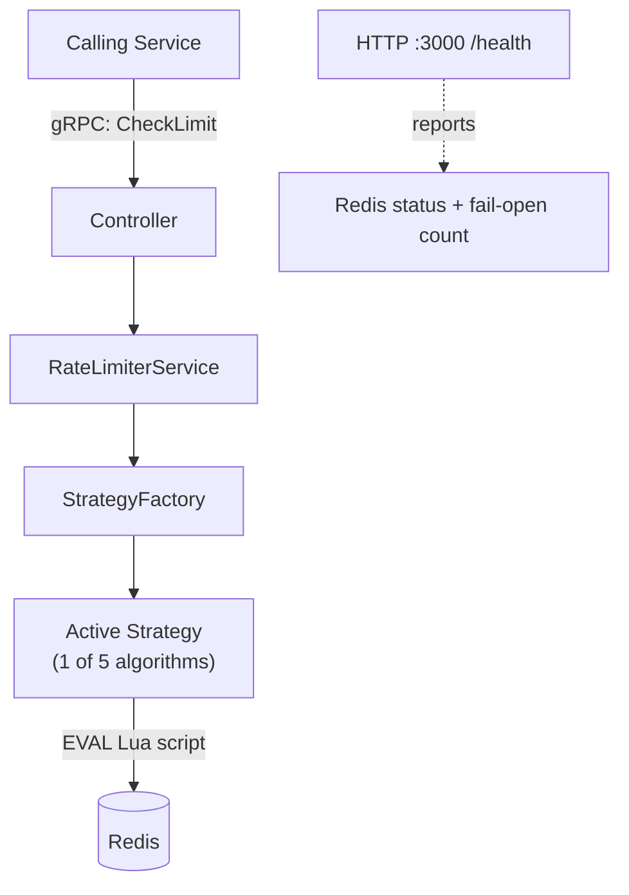

# ⚡ Rate Limiter as a Service

A production-shaped, config-switchable rate limiting microservice — built as standalone infrastructure other services call over **gRPC**, not middleware bolted onto one app.

Implements **all 5 major rate limiting algorithms** behind one interface (Strategy Pattern), each backed by an **atomic Redis Lua script** to eliminate check-then-decrement race conditions under concurrent load.

---

## 🧠 Why this exists

Most rate limiting is middleware inside a single app. This treats it as **shared infrastructure**: one gRPC endpoint — `CheckLimit(key) → allowed/denied` — that any number of services call in milliseconds.

Built as a systems-design learning project covering atomic concurrency control, the Strategy Pattern, gRPC contracts, and graceful degradation with real observability.

---

## 🏗️ Architecture



**Key decision:** the algorithm is picked **once, at bootstrap**, from config — not per request. Mirrors how real infra teams roll out algorithm changes: a deliberate redeploy, not runtime branching.

---

## 🎛️ The 5 algorithms

| Algorithm                  | Redis structure     | Trade-off                                                                      |
| -------------------------- | ------------------- | ------------------------------------------------------------------------------ |
| **Token Bucket**           | Hash                | Smooth continuous refill, allows controlled bursts. Industry default.          |
| **Fixed Window**           | Counter             | Cheapest, but boundary-burst exploit (2× traffic at window edges)              |
| **Sliding Window Log**     | Sorted Set          | Most precise, no boundary exploit — but memory scales with volume              |
| **Sliding Window Counter** | 2 weighted counters | Production-realistic middle ground: near-Log accuracy, near-Fixed-Window cost  |
| **Leaky Bucket**           | Hash                | Smooths _outflow_ to a constant rate — traffic shaping, not just capping input |

Switching algorithms = one `.env` line. Zero changes to Controller/Service.

### Why atomicity matters

Naively (separate `GET` → compute → `SET`), two concurrent requests can both read "9 left," both allow, both write "8 left" — silently exceeding the limit. **Fix:** the entire check-and-update runs as one Redis `EVAL` (Lua) call — atomic by construction. Verified by firing 15–20 concurrent requests at each strategy and confirming allowed count never exceeds capacity.

---

## 🛡️ Fail-open strategy

If Redis is unreachable, the service **fails open** (allows requests) rather than blocking everything — safer default for most products. Not silent:

- Every fail-open event increments a counter, exposed via `GET /health`
- Every response includes `checked: boolean` — `false` means "allowed without validation," so callers can log/alert on it

```json
{
  "status": "degraded",
  "redis": { "connected": false },
  "failOpen": { "totalFailOpenEvents": 3, "lastFailOpenAt": 1786970136975 }
}
```

---

## 🧰 Stack

NestJS · gRPC · Redis 7 · Docker Compose · 100% local, zero cloud cost

---

## 📁 Structure

```
src/
├── rate-limiter/
│   ├── rate-limiter.controller.ts   # gRPC handler
│   ├── rate-limiter.service.ts      # thin orchestrator
│   ├── strategy.factory.ts          # picks + configures active strategy
│   └── strategies/
│       ├── token-bucket/            # .strategy.ts + .config.ts + .lua, self-contained
│       ├── fixed-window/
│       ├── sliding-window-log/
│       ├── sliding-window-counter/
│       └── leaky-bucket/
├── redis/          # evalScript() + isHealthy()
├── observability/  # /health + fail-open counter
└── config/
```

Each strategy folder is self-contained — delete it, the feature's gone cleanly, nothing else breaks.

---

## 🚀 Running it

```bash
cp .env.example .env   # set RATE_LIMIT_STRATEGY + params
make up                # docker compose up --build
make health             # check service + Redis status
make test-call          # single gRPC call
make test-load N=20     # 20 concurrent calls — proves atomicity
make redis-cli          # inspect raw Redis state
make down
```

Standalone test client (simulates a real consuming service):

```bash
node client.js my-key 15
```

---

## 🔭 What's next

- Per-key config overrides (currently global via env)
- Prometheus `/metrics` endpoint (currently an in-memory counter)
- Real circuit breaker (`opossum`) instead of a lightweight health flag
- Unit + integration test suite

---

## 📚 What I learned

- **Atomicity isn't abstract** — watched a naive version over-allow under load, fixed it with Lua, re-verified
- **Strategy Pattern pays off** — algorithm #5 needed zero Controller/Service changes
- **Algorithms _feel_ different** — Token Bucket's smooth refill vs Sliding Log's lumpy recovery vs Fixed Window's boundary risk, seen in real numbers, not just read
- **Two real bugs, diagnosed from scratch**: a DI mistake (`new Service()` bypassing Nest's container → disconnected state) and a Docker config mistake (hardcoded `environment:` silently overriding `.env`)
